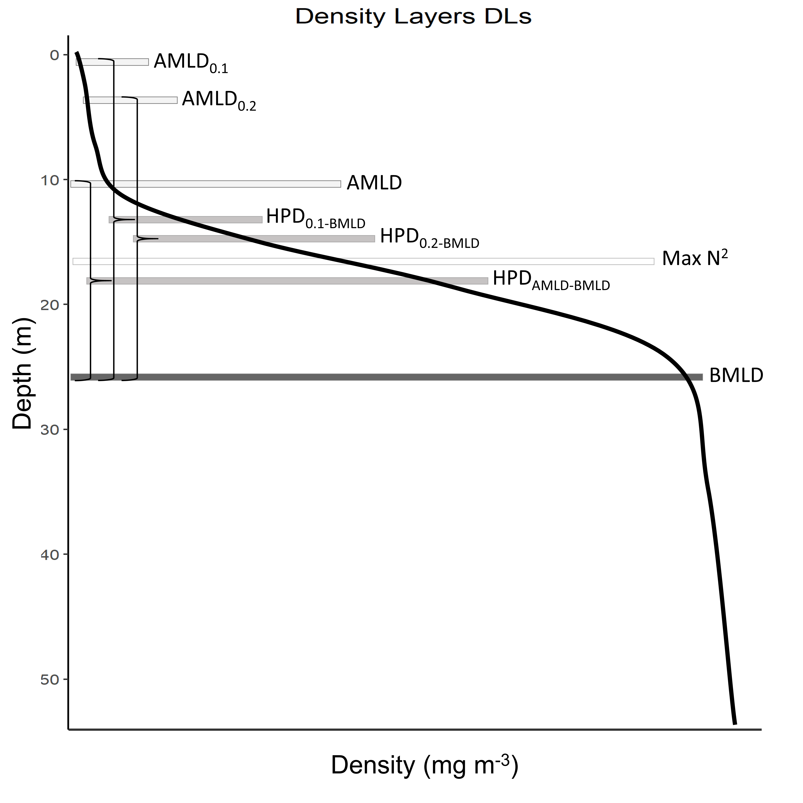

# BMLD
This page contains the code to extract BMLD from in situ profiles, an example and a brief description of the method

The function is attached to the paper published in XXXX

Add files:
Supplementary material of the paper
Function
Code in R to extract the AMLD and BMLD, and plot them
Dataset example

Write the method 
Descritption
and add some figures of the correct identification and errors. Refer to paper!!!!

