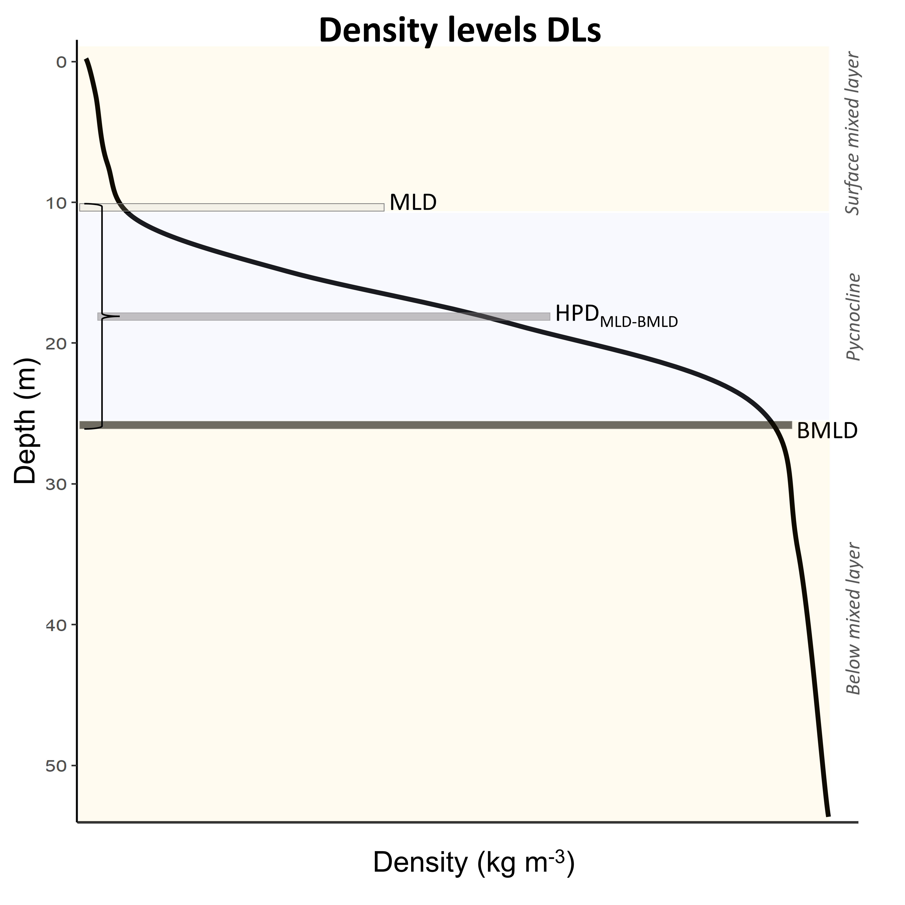
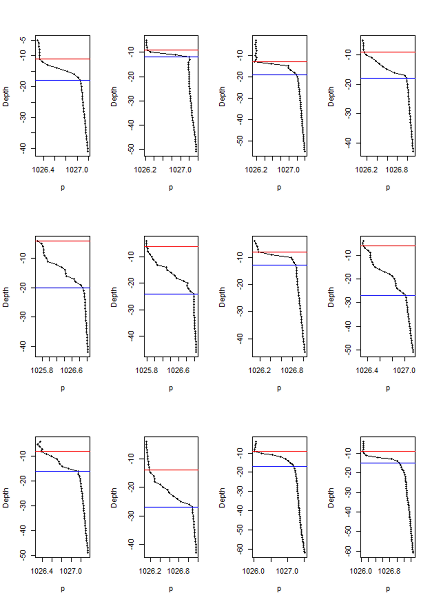

# BMLD

>*This page contains the code to extract BMLD from in situ profiles, an example and a brief description of the method*

The provided algorithm described in [Zampollo et al. 2023](https://bg.copernicus.org/articles/20/3593/2023/) detects MLD and BMLD regardless any *a priori* threshold by assuming that the mixed layer has a density difference (∆ρ) between two consecutive points close to zero (e.g. threshold methods). This method identifies the top and base of the pycnoclines investigating the shape of density profiles and allowing the identification of unconventional density vertical distribution. 
The MLD represents the last depths up to which ∆ρ is consistently small from the surface to the pycnocline, while BMLD is the end of the pycnocline from which ∆ρ is consistently small up to the seabed (Fig. 1).

***Figure 1:** The depths identifying the top (MLD) and base (BMLD) of the pycnocline throughout a density profile (black solid line).*                          
 
   
MLD and BMLD are identified by developing an algorithm based on [Chu and Fan (2011)](https://doi.org/10.1007/s10872-011-0019-2) method able to cope with various density profiles exhibiting a pycnocline (Fig. 2), with nested sub-structures such as small re-stratification at the surface, with pycnocline including a small mixed layer (Fig. 2a, e, f) or pycnoclines including different density gradients (different stratified layers) (Fig. 2 b and c). 

***Figure 2:** Examples of density profiles (grey line) (a-f). The black squares are the values at 1 m resolution. Red dots refer to BMLD, green dots to AMLD. Crosses refer to misidentified MLD (in green) and BMLD (in red) that needed to be manually corrected. This figure also reports the errors originated by the algorithm, which have been further described below.* 


The algorithm’s sequence (see details in [Supplementary materials](https://github.com/azampollo/BMLD/blob/main/SuppMat.docx)) identifies the depth with the largest density difference between a mixed and a stratified layer (Fig. 1) using i) an adaptation of the maximum angle method ([Chu and Fan 2011](https://doi.org/10.1007/s10872-011-0019-2)) and ii) a cluster analysis on the density difference (∆ρ) between two consecutive points. The method is designed to work with equal, high-resolution (1 meter), intervals of density values (z) in the profiles (Fig. 3). The algorithm is designed for shelf stratified waters, with a pycnocline defined by more than ~ 4 points, and BMLD distributed within 90% of the observations from the surface to the seabed. 
Major errors in identifying MLD (6.76% of the profiles) and BMLD (4.32%) occurred in density profiles with a smooth transition from the mixed layer to the pycnocline, hence reporting a high number of observations at the mixed layer depths (e.g. Fig. 2 a-c). The algorithm did not correctly identify MLD in profiles without an upper mixed layer and a shallow pycnocline that comprised two different gradients (Fig. 2 c). Moreover, this method is sensitive to the sampling frequency at the transition regions between mixed waters and the pycnocline. Other errors were related to profiles having a pycnocline split into two parts by a thin mixed layer having > 4 observations (Fig. 2 e), or for profiles having a pycnocline < 3 m.

The identification of MLD and BMLD is supported by the function [abmld.R](https://github.com/azampollo/BMLD/blob/main/R%20code/abmld.R). Some examples of its use are reported in [Get_amld_bmld.R](https://github.com/azampollo/BMLD/blob/main/R%20code/Get_amld_bmld.R) (the sampled profiles are reported in Fig. 3 with MLD and BMLD). The function can identify both MLD and BMLD (argument "both=T" must be specified) or BMLD only ("both=F" default). The function will delete rows with NA values, and identify MLD up to 30 m (hence can be applied mainly in shelf waters). It returns a dataframe with the names of the profiles, the depths of AMLD and BMLD, and the number of observations between AMLD and BMLD (which is useful to check the identification of profiles having either a small or big number of observations within the pycnocline). 

***Figure 3:** Examples of density profiles (black lines) whit observations at 1 m (black dots). MLD (red horizontal line) and BMLD (blue horizontal line) are reported for each profile using [abmld.R](https://github.com/azampollo/BMLD/blob/main/R%20code/abmld.R).*
 

[abmld.R](https://github.com/azampollo/BMLD/blob/main/R%20code/abmld.R) is set up to work with the first 90% of the observations from the surface to the seabed (10% of the deepest points are not used). This setting is not ideal if your profiles have BMLD very close to the end (deep portion) of your density profiles. If you want to run the function using all the points of the profile, in [abmld.R](https://github.com/azampollo/BMLD/blob/main/R%20code/abmld.R) you have to comment L. 103-104 and uncomment L. 106-107 as shown below:

````
## USE L. 103-104 IF YOU WANT TO SET THE BOTTOM LIMIT OF SPLIT2 TO EXCLUDE 10% OF THE DEEPEST OBSERVATIONS
#per15 <- nrow(dd)-round((dd$pressure[nrow(dd)]*10)/100)
#d <- dd[1:per15,]
# USE L. 106-107 IF YOU WANT TO USE THE WHOLE DENSITY PROFILE
per15 <- nrow(dd)
d <- dd[1:per15,]
````

Further details on the application of BMLD are reported in [Zampollo et al. 2023](https://bg.copernicus.org/articles/20/3593/2023/).
