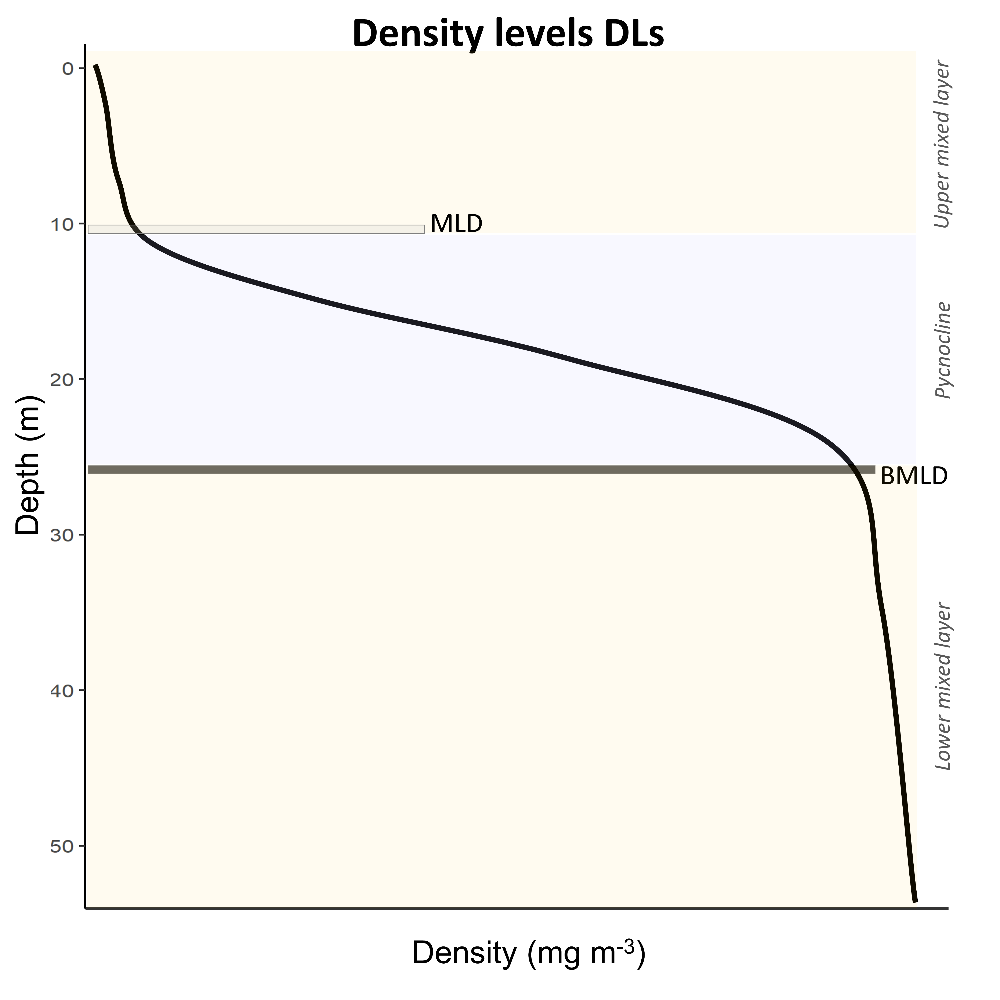

# BMLD

The provided algorithm described in [Zampollo et al. 2022](https://egusphere.copernicus.org/preprints/2022/egusphere-2022-140/) detects MLD and BMLD regardless any *a priori* threhsold by assuming that the mixed layer has a density gradient (∆ρ) close to zero (e.g. threshold methods). This method identifies the top and base of the pycnoclines investigating the shape of density profiles and allowing the identification of unconventional density vertical distribution. 
The MLD represents the last depths up to which ∆ρ is consistently small from the surface to the pycnocline, while the BMLD is the first depth after the pycnocline a from which ∆ρ is consistently small up to the seabed (Fig. 1).

Figure 1

   
MLD and BMLD are identified developing an algorithm based on [Chu and Fan (2011)](https://doi.org/10.1007/s10872-011-0019-2) method able to cope with various density profiles exhibiting a pycnocline (Fig. 2), with nested sub-structures such as small re-stratification at the surface, with pycnocline including a small mixed layer (Fig. 2a, e, f) or pycnoclines including different density gradients (different stratified layers) (Fig. 2b and c). 

Figure 2


The algorithm’s sequence (see details in [Supplementary materials](https://github.com/azampollo/BMLD/blob/main/SuppMat.docx)) identifies the depth with the largest density difference between a mixed and a stratified layer (Fig. 1) using i) an adaptation of the maximum angle method ([Chu and Fan 2011](https://doi.org/10.1007/s10872-011-0019-2)) and ii) a cluster analysis on the density difference (∆ρ). The method is designed to work with equal, high-resolution (1 meter), intervals of density values (z) in the profiles (Fig. 3). The algorithm is designed for shelf stratified waters, with a pycnocline defined by > 5 points, and BMLD distributed within 90% of the observations from the surface to the seabed. 

The identification of MLD and BMLD is supported by the function [abmld.R](https://github.com/azampollo/BMLD/blob/main/R%20code/abmld.R). Some exaples of its use are reported in [Get_amld_bmld.R](https://github.com/azampollo/BMLD/blob/main/R%20code/Get_amld_bmld.R) (the sampled profiles are reported in Fig. 3 with MLD and BMLD). The function can identify both MLD and BMLD, or BMLD only (argument "both=F" must be specified in this case). The function will delete rows with NA values, and identify MLD up to 30 m. It returns a dataframe with the name of the profile, the depth of AMLD and BMLD, and the number of observations between AMLD and BMLD (which is useful to check the identification of profiles having either a small or big number of observations within the pycnocline).

Figure 3


Since [abmld.R](https://github.com/azampollo/BMLD/blob/main/R%20code/abmld.R) has been coded to use 90% of the obseravtions from the surface to the seabed, the ame set up is not working if your profiles have BMLD very close to the end (deep portion) of the density profiles. If you want to run the function using all the points of your profile, in [abmld.R](https://github.com/azampollo/BMLD/blob/main/R%20code/abmld.R) you hvae to comment L. 103-104 and uncomment L. 106-107 as shown below:

````
## USE L. 103-104 IF YOU WANT TO SET THE BOTTOM LIMIT OF SPLIT2 TO EXCLUDE 10% OF THE DEEPEST OBSERVATIONS
#per15 <- nrow(dd)-round((dd$pressure[nrow(dd)]*10)/100)
#d <- dd[1:per15,]
# USE L. 106-107 IF YOU WANT TO USE THE WHOLE DENSITY PROFILE
per15 <- nrow(dd)
d <- dd[1:per15,]
````

More details are reported in [Zampollo et al. 2022](https://egusphere.copernicus.org/preprints/2022/egusphere-2022-140/).

Figures' captions
-------------------------
**Figure 1:** The depths identifying the beginning (AMLD) and end (BMLD) of the pycnocline througout a density profile (black solid line).                              
This page contains the code to extract BMLD from in situ profiles, an example and a brief description of the method

**Figure 2:** Examples of density profiles (grey line) (a-f). The black squares are the values at 1 m resolution. Red dots refer to BMLD, green dots to AMLD. Crosses refer to misidentified AMLD (in green) and BMLD (in red) that needed to be manually corrected.   

**Figure 3:** Examples of density profiles (black lines) whit observations at 1 m (black dots). AMLD (red horixontal line) and BMLD (blue horizontal line) are reported for each profile using [abmld.R](https://github.com/azampollo/BMLD/blob/main/R%20code/abmld.R).
