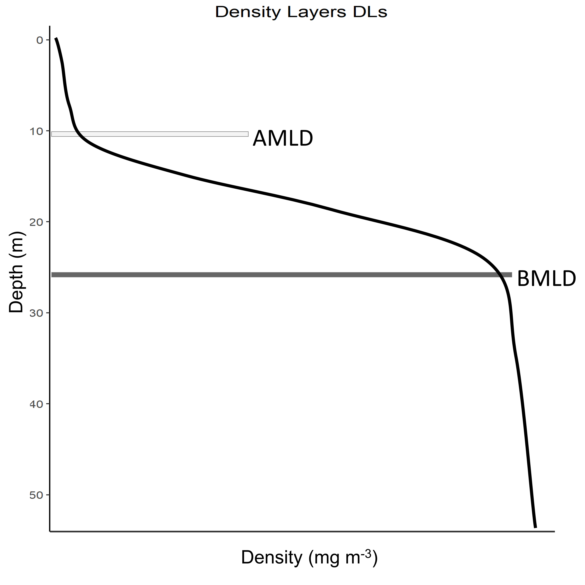
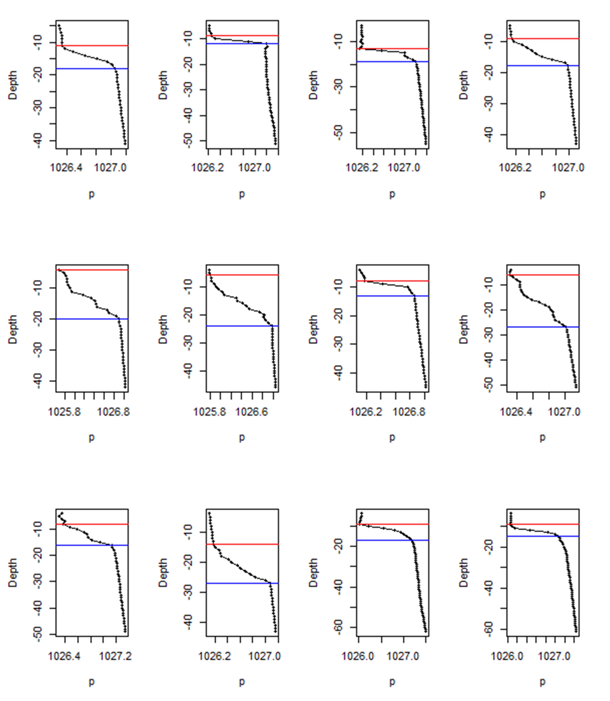

# BMLD

In the proposed algorithm described in [Zampollo et al. 2022](https://egusphere.copernicus.org/preprints/2022/egusphere-2022-140/), the detection of AMLD does not assume that the mixed layer has a density difference (∆ρ) close to zero (e.g. threshold methods), and it identifies MLDs regardless any a priori threshold. It also picks up the shallowest and deepest limits of the pycnocline by excluding middle breaks of the pycnocline, allowing the identification of unconventional density vertical distribution. 
The AMLD represents the last depths up to which ∆ρ is consistently small from the surface to the pycnocline, while the BMLD is the first depth after the pycnocline a from which ∆ρ is consistently small up to the seabed (Fig. 1).

Figure 1

   
AMLD and BMLD have been identified developing an algorithm based on [Chu and Fan (2011)](https://doi.org/10.1007/s10872-011-0019-2) framework to produce a method able to cope with various density profiles exhibiting a pycnocline (Fig. 2), with nested sub-structures such as small re-stratification at the surface, or when the pycnocline can include a small mixed layer (Fig. 2a, e, f) or presents different density gradients (stratified layers) within it (Fig. 2b and c). 

Figure 2

The algorithm’s sequence (see details in [Supplementary materials](https://github.com/azampollo/BMLD/blob/main/SuppMat.docx)) identifies the depth with the largest density difference between a mixed and a stratified layer using i) an adaptation of the maximum angle method ([Chu and Fan 2011](https://doi.org/10.1007/s10872-011-0019-2)) and ii) a cluster analysis on the density difference (∆ρ). The method is designed to work with equal, high-resolution, intervals of density values (z) in the profiles (Fig. 3).

The method is coded into the function [abmld.R](https://github.com/azampollo/BMLD/blob/main/R%20code/abmld.R), whose use is given with some examples in [Get_amld_bmld.R](https://github.com/azampollo/BMLD/blob/main/R%20code/Get_amld_bmld.R) (the sampled profiles are reported in Fig. 3 with AMLD and BMLD). The identification can be done for both AMLD and BMLD, or just for BMLD. The function will delete rows with NA values, and identify AMLD up to 30 m. It returns a dataframe with the name of the profile, the depth of AMLD and BMLD, and the number of observations between AMLD and BMLD (which is useful to check the identification of profiles having either a small or big number of observations within the pycnocline).

Figure 3

More details are reported in [Zampollo et al. 2022](https://egusphere.copernicus.org/preprints/2022/egusphere-2022-140/).

Figures' captions
-------------------------
**Figure 1:** The depths identifying the beginning (AMLD) and end (BMLD) of the pycnocline througout a density profile (black solid line).                              
This page contains the code to extract BMLD from in situ profiles, an example and a brief description of the method

**Figure 2:** Examples of density profiles (grey line) (a-f). The black squares are the values at 1 m resolution. Red dots refer to BMLD, green dots to AMLD. Crosses refer to misidentified AMLD (in green) and BMLD (in red) that needed to be manually corrected.   

**Figure 3:** Examples of density profiles (black lines) whit observations at 1 m (black dots). AMLD (red horixontal line) and BMLD (blue horizontal line) are reported for each profile using [abmld.R](https://github.com/azampollo/BMLD/blob/main/R%20code/abmld.R).
